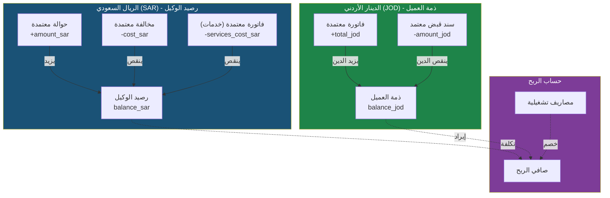
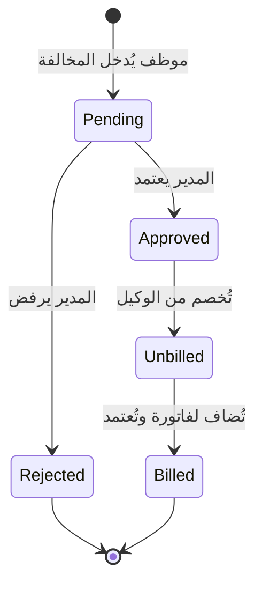
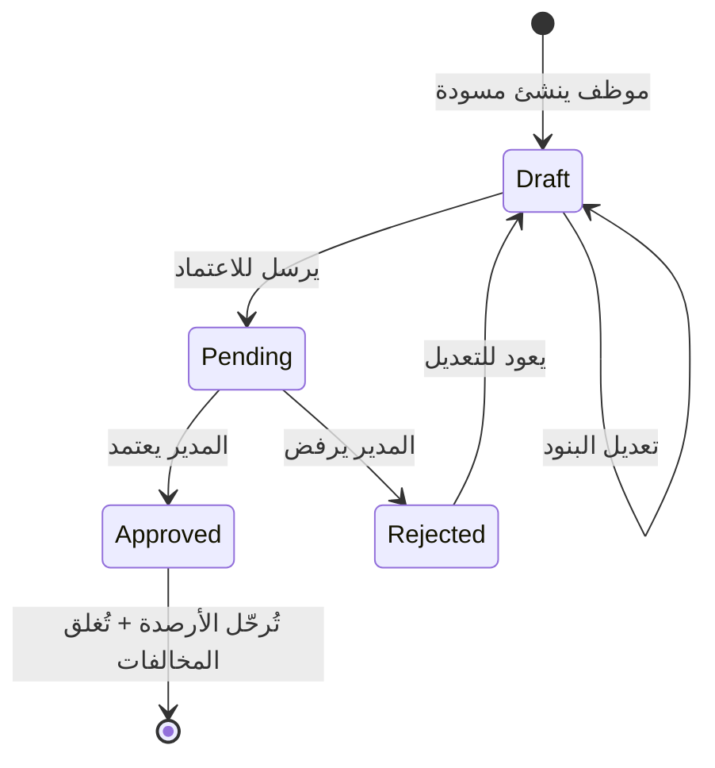

# OFOQ - مخطط علاقات الكيانات (ERD)

## المخطط المرئي الشامل

```mermaid
erDiagram
    roles ||--o{ users : "has many"
    roles ||--o{ role_permissions : "has many"
    permissions ||--o{ role_permissions : "has many"

    users ||--o{ transfers : "creates"
    users ||--o{ receipts : "creates"
    users ||--o{ violations : "creates"
    users ||--o{ invoices : "creates"
    users ||--o{ expenses : "creates"
    users ||--o{ notifications : "receives"

    agents ||--o{ transfers : "receives"
    agents ||--o{ violations : "charged"
    agents ||--o{ invoices : "linked"

    clients ||--o{ receipts : "pays"
    clients ||--o{ violations : "belongs"
    clients ||--o{ invoices : "billed"

    violation_types ||--o{ violations : "categorizes"
    expense_categories ||--o{ expenses : "categorizes"

    invoices ||--o{ invoice_items : "contains"
    services ||--o{ invoice_items : "referenced"
    violations ||--o{ invoice_items : "referenced"

    roles {
        int id PK
        varchar name
        varchar slug
    }

    permissions {
        int id PK
        varchar name
        varchar slug
        varchar module
    }

    users {
        int id PK
        varchar name
        varchar email
        int role_id FK
        varchar locale
        varchar theme
        boolean is_active
        text fcm_token
    }

    agents {
        int id PK
        varchar name
        varchar code UK
        varchar phone
        varchar country
        decimal balance_sar "DECIMAL(15,2)"
        boolean is_active
    }

    clients {
        int id PK
        varchar name
        varchar code UK
        varchar phone
        varchar country
        decimal balance_jod "DECIMAL(15,3)"
        decimal credit_limit_jod "DECIMAL(15,3)"
        boolean is_active
    }

    services {
        int id PK
        varchar name
        varchar code UK
        decimal default_price_sar "DECIMAL(15,2)"
        decimal default_price_jod "DECIMAL(15,3)"
        boolean is_active
    }

    violation_types {
        int id PK
        varchar name
        varchar code UK
        decimal default_cost_sar "DECIMAL(15,2)"
    }

    exchange_rates {
        int id PK
        date rate_date UK
        decimal sar_to_jod "DECIMAL(10,6)"
        decimal jod_to_sar "DECIMAL(10,6)"
        int set_by FK
    }

    transfers {
        int id PK
        varchar transfer_number UK
        int agent_id FK
        decimal amount_sar "DECIMAL(15,2)"
        decimal cost_jod "DECIMAL(15,3)"
        decimal exchange_rate "DECIMAL(10,6)"
        varchar payment_method
        date transfer_date
        varchar status "pending/approved/rejected"
        int created_by FK
        int approved_by FK
    }

    receipts {
        int id PK
        varchar receipt_number UK
        int client_id FK
        decimal amount_jod "DECIMAL(15,3)"
        varchar payment_method
        date receipt_date
        varchar status "pending/approved/rejected"
        int created_by FK
        int approved_by FK
    }

    expense_categories {
        int id PK
        varchar name
        varchar code UK
    }

    expenses {
        int id PK
        varchar expense_number UK
        int category_id FK
        text description
        decimal amount "DECIMAL(15,3)"
        varchar currency "JOD/SAR"
        date expense_date
        varchar status "pending/approved/rejected"
        int created_by FK
        int approved_by FK
    }

    violations {
        int id PK
        varchar violation_number UK
        int agent_id FK
        int client_id FK
        int violation_type_id FK
        varchar passport_number
        decimal cost_sar "DECIMAL(15,2)"
        date violation_date
        varchar billing_status "unbilled/billed"
        int invoice_id FK
        varchar status "pending/approved/rejected"
        int created_by FK
        int approved_by FK
    }

    invoices {
        int id PK
        varchar invoice_number UK
        int agent_id FK
        int client_id FK
        decimal exchange_rate_snapshot "DECIMAL(10,6)"
        decimal total_sar "DECIMAL(15,2)"
        decimal total_jod "DECIMAL(15,3)"
        decimal services_cost_sar "DECIMAL(15,2)"
        decimal violations_cost_sar "DECIMAL(15,2)"
        decimal profit_sar "DECIMAL(15,2)"
        date invoice_date
        varchar status "draft/pending/approved/rejected"
        int created_by FK
        int approved_by FK
    }

    invoice_items {
        int id PK
        int invoice_id FK
        varchar item_type "service/violation"
        int service_id FK
        int violation_id FK
        varchar description
        int quantity
        decimal unit_price_sar "DECIMAL(15,2)"
        decimal sell_price_jod "DECIMAL(15,3)"
        decimal total_cost_sar "DECIMAL(15,2)"
        decimal total_sell_jod "DECIMAL(15,3)"
    }

    ledger_entries {
        int id PK
        varchar entity_type "agent/client"
        int entity_id
        varchar transaction_type
        int transaction_id
        decimal debit "DECIMAL(15,3)"
        decimal credit "DECIMAL(15,3)"
        decimal balance_after "DECIMAL(15,3)"
        varchar currency "SAR/JOD"
    }

    notifications {
        int id PK
        int user_id FK
        varchar title
        varchar type
        boolean is_read
    }

    activity_logs {
        int id PK
        int user_id FK
        varchar action
        varchar model_type
        int model_id
        jsonb old_values
        jsonb new_values
    }

    attachments {
        int id PK
        varchar attachable_type
        int attachable_id
        varchar file_name
        varchar file_path
    }

    settings {
        int id PK
        varchar key UK
        text value
        varchar group_name
        varchar type
    }
```

---

## تدفق الأرصدة المالية

```mermaid
flowchart TD
    subgraph SAR["الريال السعودي (SAR) - رصيد الوكيل"]
        T["حوالة معتمدة<br/>+amount_sar"] -->|يزيد| AB["رصيد الوكيل<br/>balance_sar"]
        V["مخالفة معتمدة<br/>-cost_sar"] -->|ينقص| AB
        IS["فاتورة معتمدة (خدمات)<br/>-services_cost_sar"] -->|ينقص| AB
    end

    subgraph JOD["الدينار الأردني (JOD) - ذمة العميل"]
        IJ["فاتورة معتمدة<br/>+total_jod"] -->|يزيد الدين| CB["ذمة العميل<br/>balance_jod"]
        R["سند قبض معتمد<br/>-amount_jod"] -->|ينقص الدين| CB
    end

    subgraph PROFIT["حساب الربح"]
        AB -.->|تكلفة| P["صافي الربح"]
        CB -.->|إيراد| P
        EX["مصاريف تشغيلية"] -.->|خصم| P
    end

    style SAR fill:#1a5276,color:#fff
    style JOD fill:#1e8449,color:#fff
    style PROFIT fill:#7d3c98,color:#fff
```

---

## دورة حياة المخالفة

```mermaid
stateDiagram-v2
    [*] --> Pending: موظف يُدخل المخالفة
    Pending --> Approved: المدير يعتمد
    Pending --> Rejected: المدير يرفض
    Approved --> Unbilled: تُخصم من الوكيل
    Unbilled --> Billed: تُضاف لفاتورة وتُعتمد
    Rejected --> [*]
    Billed --> [*]
```

---

## دورة حياة الفاتورة

```mermaid
stateDiagram-v2
    [*] --> Draft: موظف ينشئ مسودة
    Draft --> Pending: يرسل للاعتماد
    Draft --> Draft: تعديل البنود
    Pending --> Approved: المدير يعتمد
    Pending --> Rejected: المدير يرفض
    Approved --> [*]: تُرحّل الأرصدة + تُغلق المخالفات
    Rejected --> Draft: يعود للتعديل
```
