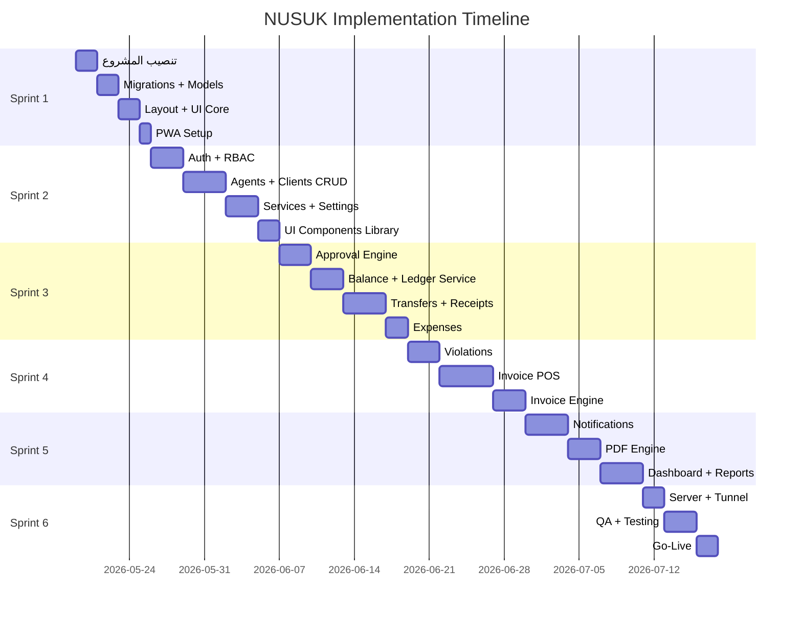

# خطة العمل التنفيذية - OFOQ System
# Implementation Master Plan

> **المدة**: 8-10 أسابيع | **المنهجية**: Agile/Scrum | **6 Sprints**

---

## 📋 نتائج تحليل ملفات السياق

### ما تم استخلاصه:
- **17 جدول** بعلاقات محددة بدقة (DATABASE.md)
- **50+ route** موزعة على 10 وحدات (ROUTES_API.md)
- **6 Services** أساسية + **3 Traits** مشتركة (ARCHITECTURE.md)
- **5 أنماط ترقيم** تلقائية + قواعد عملات صارمة (CONVENTIONS.md)
- **عملتين**: SAR(2 decimals) + JOD(3 decimals) مع سعر صرف يومي

### قيود يجب احترامها:
1. DECIMAL فقط للحقول المالية (ممنوع FLOAT)
2. Maker-Checker إجباري لكل العمليات المالية
3. DB Transaction لكل عملية تؤثر على الأرصدة
4. سعر الصرف يُجمّد (snapshot) داخل الفاتورة

---

## 🟩 Sprint 1: البنية التحتية (الأسبوع 1)

### المهمة 1.1: تنصيب المشروع
| الخطوة | الأمر / الملف | الهدف |
|--------|---------------|-------|
| 1 | `composer create-project laravel/laravel .` | Laravel 11 |
| 2 | `npm install vue@3 @inertiajs/vue3 @vitejs/plugin-vue` | Vue 3 + Inertia |
| 3 | `npm install tailwindcss @tailwindcss/forms` | Tailwind CSS |
| 4 | `composer require inertiajs/inertia-laravel tightenco/ziggy` | Inertia Backend |
| 5 | تهيئة `.env` مع PostgreSQL | ربط قاعدة البيانات |

### المهمة 1.2: إنشاء Migrations (17 ملف)
**ترتيب التنفيذ حسب التبعيات:**

```
01_create_roles_table
02_create_permissions_table
03_create_role_permissions_table
04_create_users_table (FK→roles)
05_create_agents_table (FK→users)
06_create_clients_table (FK→users)
07_create_services_table
08_create_violation_types_table
09_create_exchange_rates_table (FK→users)
10_create_settings_table
11_create_expense_categories_table
12_create_transfers_table (FK→agents, users)
13_create_receipts_table (FK→clients, users)
14_create_expenses_table (FK→expense_categories, users)
15_create_invoices_table (FK→agents, clients, users)
16_create_violations_table (FK→agents, clients, violation_types, invoices, users)
17_create_invoice_items_table (FK→invoices, services, violations)
18_create_ledger_entries_table
19_create_notifications_table (FK→users)
20_create_activity_logs_table (FK→users)
21_create_attachments_table
```

### المهمة 1.3: إنشاء Eloquent Models (17 model)
**لكل Model يجب تحديد:**
- `$fillable` / `$casts`
- `relationships()` حسب ERD
- Traits: `HasApproval`, `HasAttachments`, `Auditable`

| Model | العلاقات الرئيسية |
|-------|-------------------|
| User | belongsTo(Role), hasMany(Transfer,Receipt,etc) |
| Agent | hasMany(Transfer,Violation,Invoice), belongsTo(User,'created_by') |
| Client | hasMany(Receipt,Violation,Invoice) |
| Transfer | belongsTo(Agent,User,User) |
| Receipt | belongsTo(Client,User,User) |
| Violation | belongsTo(Agent,Client,ViolationType), belongsTo(Invoice) |
| Invoice | belongsTo(Agent,Client), hasMany(InvoiceItem) |
| InvoiceItem | belongsTo(Invoice,Service,Violation) |
| LedgerEntry | morphTo(entity) |

### المهمة 1.4: Seeders الأساسية
- `RoleSeeder`: admin, sales, accountant
- `PermissionSeeder`: ~40 صلاحية (CRUD + approve لكل وحدة)
- `SettingSeeder`: إعدادات الشركة الافتراضية
- `UserSeeder`: مستخدم admin افتراضي

### المهمة 1.5: تهيئة الواجهة
- `app.blade.php` → Inertia root template
- `AppLayout.vue` → Sidebar + Navbar + Content
- محرك اللغة (ar/en) → `useLocale` composable
- الوضع الداكن/المضيء → `useTheme` composable
- اتجاه RTL/LTR ديناميكي

### المهمة 1.6: PWA
- `public/manifest.json`
- `public/sw.js` (Service Worker)
- أيقونات بأحجام متعددة

**📦 ناتج Sprint 1:** مشروع يعمل مع DB فارغة + layout أساسي + PWA جاهز

---

## 🟩 Sprint 2: الكيانات والصلاحيات (الأسبوع 2-3)

### المهمة 2.1: نظام المصادقة (Auth)
| الملف | المحتوى |
|-------|---------|
| `AuthController` | login, logout |
| `Pages/Auth/Login.vue` | شاشة دخول احترافية |
| `Middleware/HandleInertiaRequests` | مشاركة بيانات المستخدم + صلاحيات |

### المهمة 2.2: نظام الصلاحيات (RBAC)
| الملف | المحتوى |
|-------|---------|
| `CheckPermission` middleware | التحقق من الصلاحية قبل كل route |
| `usePermission.js` composable | `can('transfers.approve')` في Vue |
| Policies لكل model | `view`, `create`, `update`, `delete`, `approve` |

### المهمة 2.3: شاشات الوكلاء (Agents)
| Route | الشاشة | المكونات |
|-------|--------|----------|
| GET /agents | Index.vue | DataTable + فلترة + بحث |
| GET /agents/create | Create.vue | فورم: name,code,phone,email,address,city |
| GET /agents/{id} | Show.vue | بطاقة + رصيد + آخر الحركات |
| GET /agents/{id}/edit | Edit.vue | نفس فورم الإنشاء + تعبئة البيانات |

**Backend:** `AgentController` (CRUD) + `StoreAgentRequest` + `UpdateAgentRequest`

### المهمة 2.4: شاشات العملاء (Clients)
نفس هيكلية الوكلاء مع اختلاف الحقول (balance_jod, credit_limit_jod)

### المهمة 2.5: شاشات الخدمات وأنواع المخالفات
- `ServiceController` + `Pages/Services/Index,Create,Edit`
- `ViolationTypeController` + `Pages/ViolationTypes/Index,Create,Edit`

### المهمة 2.6: شاشة الإعدادات
- `SettingController@index` → عرض الإعدادات مجمّعة (company, printing, notifications)
- `SettingController@update` → حفظ جماعي
- `ExchangeRateController` → إدخال سعر صرف اليوم

### المهمة 2.7: مكونات UI مشتركة
| المكون | الوظيفة |
|--------|---------|
| `DataTable.vue` | جدول مع pagination, sorting, search |
| `Modal.vue` | نافذة منبثقة |
| `StatusBadge.vue` | عرض الحالة بألوان (pending=yellow, approved=green, rejected=red) |
| `CurrencyDisplay.vue` | عرض المبلغ بالعملة الصحيحة (SAR/JOD) |
| `ApprovalActions.vue` | أزرار الاعتماد/الرفض (للمدير فقط) |
| `FormInput.vue` | حقل إدخال موحّد مع validation |

**📦 ناتج Sprint 2:** CRUD كامل للبيانات التأسيسية + صلاحيات + UI components

---

## 🟩 Sprint 3: المحرك المالي والاعتمادات (الأسبوع 4-5)

### المهمة 3.1: محرك الاعتماد (Approval Engine)

**Trait: `HasApproval`**
```php
// يُضاف لـ Transfer, Receipt, Violation, Invoice, Expense
trait HasApproval {
    scopePending(), scopeApproved(), scopeRejected()
    approve(User $approver): void  // → fires Event
    reject(User $approver, string $reason): void
    isPending(), isApproved(), isRejected()
}
```

**Service: `ApprovalService`**
```php
approve(Model $model): void {
    DB::transaction(function() {
        $model->update([status, approved_by, approved_at]);
        event(new ModelApproved($model));  // → triggers balance update
    });
}
```

### المهمة 3.2: خدمة الأرصدة (BalanceService)
```php
class BalanceService {
    // الحوالات: يزيد رصيد الوكيل
    creditAgent(Agent, amount_sar, transaction_type, transaction_id)
    // المخالفات + الفواتير: ينقص رصيد الوكيل
    debitAgent(Agent, amount_sar, transaction_type, transaction_id)
    // الفواتير: يزيد دين العميل
    debitClient(Client, amount_jod, transaction_type, transaction_id)
    // سندات القبض: ينقص دين العميل
    creditClient(Client, amount_jod, transaction_type, transaction_id)
}
```
**كل method يُنشئ ledger_entry + يُحدّث cached balance داخل DB::transaction**

### المهمة 3.3: خدمة الترقيم (NumberingService)
```php
generate(string $prefix, string $date): string
// مثال: generate('TRF', '2026-05-18') → 'TRF-20260518-0001'
```

### المهمة 3.4: شاشة الحوالات (Transfers)
| العنصر | التفاصيل |
|--------|----------|
| Create.vue | اختيار وكيل + مبلغ SAR + تكلفة JOD + سعر صرف (auto-fill) + طريقة دفع + مرفق |
| Index.vue | جدول مع tabs (الكل/معلقة/معتمدة/مرفوضة) |
| Show.vue | تفاصيل + أزرار اعتماد/رفض (للمدير) |
| **Event**: `TransferApproved` | → `BalanceService->creditAgent()` |

### المهمة 3.5: شاشة سندات القبض (Receipts)
| العنصر | التفاصيل |
|--------|----------|
| Create.vue | اختيار عميل + مبلغ JOD + طريقة دفع + تفاصيل شيك |
| **Event**: `ReceiptApproved` | → `BalanceService->creditClient()` |

### المهمة 3.6: شاشة المصاريف (Expenses)
| العنصر | التفاصيل |
|--------|----------|
| Create.vue | تصنيف + وصف + مبلغ + عملة (JOD/SAR) + طريقة دفع |
| **Event**: `ExpenseApproved` | → تسجيل في activity_log فقط |

**📦 ناتج Sprint 3:** كل العمليات المالية تعمل مع نظام اعتماد كامل + أرصدة دقيقة

---

## 🟩 Sprint 4: المبيعات والفواتير (الأسبوع 6-7)

### المهمة 4.1: شاشة المخالفات (Violations)
| العنصر | التفاصيل |
|--------|----------|
| Create.vue | وكيل + عميل + نوع مخالفة + جواز + تكلفة SAR |
| **Event**: `ViolationApproved` | → `BalanceService->debitAgent(cost_sar)` + `billing_status='unbilled'` |

### المهمة 4.2: شاشة المبيعات التفاعلية (Invoice POS)
**أعقد شاشة في النظام - SPA بدون إعادة تحميل:**

```
┌─────────────────────────────────────────────┐
│  اختيار الوكيل (DDL)  │  اختيار العميل (DDL) │
├─────────────────────────────────────────────┤
│  سعر الصرف: [auto-fill] ← من exchange_rates │
├─────────────────────────────────────────────┤
│  بنود الفاتورة:                              │
│  [+ إضافة خدمة]  [+ إضافة مخالفة]           │
│  ┌──────────────────────────────────────┐    │
│  │ النوع │ الوصف │ الكمية │ SAR │ JOD  │    │
│  │ خدمة  │ تأشيرة│  1    │ 200 │ 15.6 │    │
│  │ مخالفة│ ....  │  1    │ 100 │ 7.8  │    │
│  └──────────────────────────────────────┘    │
│  عند اختيار "مخالفة":                        │
│  → DDL يجلب مخالفات العميل (billing_status=  │
│    'unbilled') عبر API endpoint              │
├─────────────────────────────────────────────┤
│  الإجمالي SAR: 300  │  الإجمالي JOD: 23.400 │
│  الخصم: [____]      │  الصافي: [____]        │
│                                              │
│  [حفظ كمسودة]  [إرسال للاعتماد]              │
└─────────────────────────────────────────────┘
```

### المهمة 4.3: محرك ترحيل الفاتورة (InvoiceService)
```php
class InvoiceService {
    approve(Invoice $invoice): void {
        DB::transaction(function() use ($invoice) {
            // 1. تجميد سعر الصرف
            $invoice->exchange_rate_snapshot = ExchangeRateService::today();

            // 2. خصم تكلفة الخدمات من الوكيل (المخالفات خُصمت سابقاً)
            BalanceService::debitAgent($invoice->agent, $invoice->services_cost_sar);

            // 3. إضافة الإجمالي على العميل بالدينار
            BalanceService::debitClient($invoice->client, $invoice->total_jod);

            // 4. إغلاق المخالفات المضمّنة
            $invoice->violationItems()->update([
                'billing_status' => 'billed',
                'invoice_id' => $invoice->id
            ]);

            // 5. حساب الربح
            $invoice->profit_sar = $invoice->total_jod * $rate - $invoice->total_sar;
        });
    }
}
```

### المهمة 4.4: API Endpoints للمبيعات
| Endpoint | الاستخدام |
|----------|-----------|
| `GET /api/exchange-rate/today` | تعبئة سعر الصرف تلقائياً |
| `GET /api/clients/{id}/violations/unbilled` | جلب مخالفات العميل غير المفوترة |
| `GET /api/agents/{id}/balance` | عرض رصيد الوكيل المتاح |

**📦 ناتج Sprint 4:** دورة مبيعات كاملة مع فواتير ذكية ومخالفات مزدوجة

---

## 🟩 Sprint 5: التقارير والإشعارات (الأسبوع 8-9)

### المهمة 5.1: نظام الإشعارات
| النوع | التقنية | الاستخدام |
|-------|---------|-----------|
| Push (خارج التطبيق) | Firebase FCM | إشعار المدير بعملية تحتاج اعتماد |
| Real-time (داخل التطبيق) | Laravel Reverb/WebSocket | تحديث الشاشة فوراً |
| Database | جدول notifications | تخزين + عداد غير مقروء |

**الملفات:**
- `composer require laravel/reverb` + `config/reverb.php`
- `NotificationService.php`
- `NotificationBell.vue` → أيقونة الجرس مع عداد

### المهمة 5.2: محرك PDF
| المستند | المحتوى |
|---------|---------|
| فاتورة مبيعات | بيانات الشركة + العميل + بنود + إجمالي JOD |
| كشف حساب عميل | رصيد سابق + مبيعات + دفعات + رصيد حالي (JOD) |
| كشف حساب وكيل | رصيد سابق + حوالات + مخالفات + فواتير + رصيد حالي (SAR) |

**التقنية:** `barryvdh/laravel-dompdf` مع templates Blade

### المهمة 5.3: لوحة القيادة (Dashboard)
```
┌──────────────┬──────────────┬──────────────┐
│ إجمالي أرصدة │ إجمالي ذمم   │ صافي الربح   │
│ الوكلاء SAR  │ العملاء JOD  │ الفعلي       │
├──────────────┴──────────────┴──────────────┤
│ عمليات بانتظار الاعتماد (عداد + قائمة)     │
├────────────────────────────────────────────┤
│ رسم بياني: المبيعات الشهرية               │
│ رسم بياني: المصاريف vs الإيرادات           │
├──────────────┬─────────────────────────────┤
│ آخر الفواتير │ آخر الحوالات                │
└──────────────┴─────────────────────────────┘
```

### المهمة 5.4: شاشات التقارير
| التقرير | البيانات |
|---------|----------|
| أرصدة الوكلاء | اسم + كود + balance_sar + آخر حركة |
| ذمم العملاء | اسم + كود + balance_jod + credit_limit + تجاوز |
| الأرباح والخسائر | إيرادات الفواتير - تكاليف - مصاريف = صافي |
| ملخص يومي | عمليات اليوم مجمّعة بالنوع |

**📦 ناتج Sprint 5:** نظام إشعارات + PDF + Dashboard + تقارير

---

## 🟩 Sprint 6: النشر والاختبار (الأسبوع 10)

### المهمة 6.1: تجهيز السيرفر المحلي
- تثبيت Docker + docker-compose
- Containers: PHP-FPM + Nginx + PostgreSQL + Redis
- `docker-compose.yml` جاهز للتشغيل

### المهمة 6.2: Cloudflare Tunnel
- ربط السيرفر بـ domain خاص
- تفعيل HTTPS (إلزامي لـ PWA + FCM)
- `cloudflared tunnel create nusuk`

### المهمة 6.3: الفحص الشامل (QA)
| نوع الفحص | التفاصيل |
|-----------|----------|
| دقة الأرصدة | إدخال دورة كاملة والتحقق من الأرقام العشرية |
| الصلاحيات | تجربة كل دور (admin/sales/accountant) |
| الأداء | اختبار من خارج الشبكة عبر Tunnel |
| PWA | تثبيت على الهاتف + offline + إشعارات |
| PDF | فحص كل مستند مطبوع |

### المهمة 6.4: الإطلاق
- إدخال أرصدة افتتاحية (Opening Balances) عبر `ledger_entries`
- تدريب الموظفين
- Go-Live

---

## 📊 ترتيب الأولويات حسب المهمة



---

## ⚡ أول أمر تنفيذي

عند موافقتك على هذه الخطة، سنبدأ بـ **Sprint 1 - المهمة 1.1**:

```powershell
# 1. تنصيب Laravel 11
composer create-project laravel/laravel . --prefer-dist

# 2. تنصيب Vue 3 + Inertia + Tailwind
npm install vue@3 @inertiajs/vue3 @vitejs/plugin-vue
npm install -D tailwindcss @tailwindcss/forms postcss autoprefixer

# 3. تنصيب Inertia Backend
composer require inertiajs/inertia-laravel tightenco/ziggy
```

**هل أبدأ التنفيذ؟**
